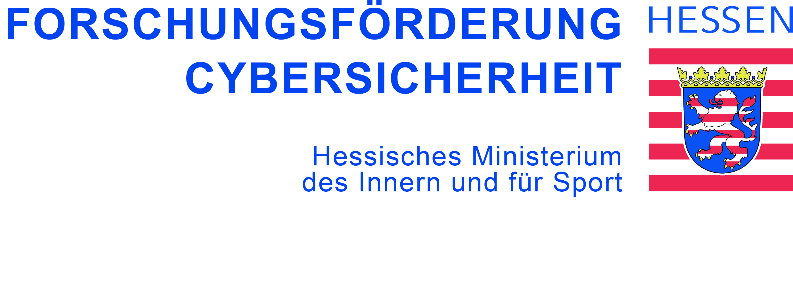

# DEQscaler
Solving differential equations or systems of such equations on an 
analog-electronic analog computer (or a fixed point digital computer or
digital differential analyser) requires these equations to be scaled so that
no variable and no sum ever exceeds the intervall [-1,1] (with -1 and 1 
denoting the "machine units" of the analog computer).

# Usage example

First import the DEQscaler class (ensure the correct working directory for the relative import) and sympy:

```python
from source.DEQscaler import DEQscaler
import sympy
```

We use the Roessler System

dx/dt = -y - z

dy/dt =  x + a*y

dz/dt =  b + z*(x-c) = b - c*z + x*z

with initial values y0 = (1, 0, 0) and parameters (a, b, c) = (.2, .2, 5.7) as an example for rescaling here.


Define the starting value y(t0) = y0 and the time frame for t, here the interval (0,25).
```python
y0 = [1, 0, 0]
t_span = (0.0, 25.0) # = (t0, tf)
```

Aggregate them as arguments for solve_ivp; the fun argument for solve_ivp will be created automatically from the sympy equations.
```python
args_solve_ivp_ini_val = [t_span, y0]
```

Throughout the following be aware of the difference between a (Python) variable, such as "a" or "y", and the object saved therein, such as sympy.Symbol('a') or sympy.Symbol('y'). 

Define the parameters used in the equation and provide their values in a dictionary.
```python
a, b, c =  sympy.symbols('a b c')
diff_eq_parameters = {a : .2, b : .2, c : 5.7}
```

Define the variables involved and use them to create the sympy represenation of the system of differential equations.
```python
t, x, y, z = sympy.symbols('t x y z')
dydt = [x, y, z]
f_t_y = [-y-z, x+a*y, b+z*(x-c)]
```

Use these to create the DEQscaler instance.
```python
Roessler = DEQscaler(args_solve_ivp_ini_val, t, dydt, f_t_y, diff_eq_parameters)
```

First verify all entries are as intended. [Note the x, y, z, a, b, c are all sympy.Symbol().]
```python
Roessler.show_eqn()
```

To obtain a list which can be used to create a rescaled equation, the .create_rescaled_Diff_Eq() can be used.
This may take some time, since the numerical integration is then performed.
```python
properties_rescaled = Roessler.create_rescaled_Diff_Eq()
```

Using these a rescaled Roessler equation can be created.
```python
Roessler_rescaled = DEQscaler(*properties_rescaled)
Roessler_rescaled.show_eqn()
```

To verify the new (absolut) maxima these can be calculated and printed.
```python
Roessler_rescaled.determine_max()
print(Roessler_rescaled.maxima)
```

This may yield unsatisfactory (cf. values >= 1) results such as:
```
{x: 1.000052590888878, y: 0.9991044611593582, z: 0.9997609510430012}
```

The calculated (absolut) maxima of the initial Roessler System are:
```python
print(Roessler.maxima)
```

```
{x: 10.435175428044776, y: 9.584035371572032, z: 2.3440549911816726}
```

When rescaling one could use increased values of these by defining a max_scale_factor, such as an addition of 1%:
```python
Roessler_2 = DEQscaler(args_solve_ivp_ini_val, t, dydt, f_t_y, diff_eq_parameters, max_scale_factor=1.01)
Roessler_rescaled_2 = DEQscaler(*Roessler_2.create_rescaled_Diff_Eq())
Roessler_rescaled_2.determine_max()
```

Now the maxima of Rossler and Roessler_2 are still the same:
```python
print(Roessler.maxima)
print(Roessler_2.maxima)
```

```
{x: 10.435175428044776, y: 9.584035371572032, z: 2.3440549911816726}
{x: 10.435175428044776, y: 9.584035371572032, z: 2.3440549911816726}
```

But the (absolut) maxima of the rescaled version with the factor is reduced and all of them are below 1:
```python
print(Roessler_rescaled.maxima)
print(Roessler_rescaled_2.maxima)
```

```
{x: 1.000052590888878,  y: 0.9991044611593582, z: 0.9997609510430012}
{x: 0.9901979740914344, y: 0.9916789571237319, z: 0.989455868543799}
```


A further approach is to increase the precision of the solve_ivp function by providing kwargs as in the documentation.
The default RK45 method can be adapted, but here the provision of max_step increases the precision (and calculation time).
For details see: https://docs.scipy.org/doc/scipy/reference/generated/scipy.integrate.solve_ivp.html

```python
kwargs_solve_ivp = {'method' : 'RK45', 'max_step' : 0.01}
Roessler_3 = DEQscaler(args_solve_ivp_ini_val, t, dydt, f_t_y, diff_eq_parameters, kwargs_solve_ivp=kwargs_solve_ivp)
```

Note that the kwargs are also passed on to the new Roessler_rescaled_3 instance.
```python
Roessler_rescaled_3 = DEQscaler(*Roessler_3.create_rescaled_Diff_Eq())
Roessler_rescaled_3.determine_max()
```

The issue may be smaller (in some cases) than before but certainly still prevails:
```python
print(Roessler_rescaled.maxima)
print(Roessler_rescaled_3.maxima)
```

```
{x: 1.000052590888878,  y: 0.9991044611593582, z: 0.9997609510430012}
{x: 1.0000144356472667, y: 1.0000098414715495, z: 1.000000000000356}
```

A max_scale_factor is hence advisible.

Of course these can also be combined.
```python
Roessler_4 = DEQscaler(args_solve_ivp_ini_val, t, dydt, f_t_y, diff_eq_parameters, max_scale_factor=1.01, kwargs_solve_ivp=kwargs_solve_ivp)
Roessler_rescaled_4 = DEQscaler(*Roessler_4.create_rescaled_Diff_Eq())
Roessler_rescaled_4.determine_max()
```

to improve upon the initial rescaling results.
```python
print(Roessler_rescaled.maxima)
print(Roessler_rescaled_2.maxima)
print(Roessler_rescaled_4.maxima)
```

```
{x: 1.000052590888878,  y: 0.9991044611593582, z: 0.9997609510430012}
{x: 0.9901979740914344, y: 0.9916789571237319, z: 0.989455868543799}
{x: 0.99011297853811,   y: 0.9901086672002818, z: 0.9900990099013388}
```


A manual choice of maxima for rescaling is also possible:
```python
import copy

print(Roessler.maxima)
manual_maxima = copy.deepcopy(Roessler.maxima)

manual_maxima[x] = 12
manual_maxima[y] = 11
manual_maxima[z] = 2.7

"""
Alternatively with same effect:
man_max = [12, 11, 2.7]
manual_maxima = {ele[0] : man_max[pos] for pos, ele in enumerate(manual_maxima.items())}
"""

properties_rescaled_5 = Roessler.create_rescaled_Diff_Eq(maxima_items=manual_maxima)
Roessler_rescaled_5 = DEQscaler(*properties_rescaled_5)

Roessler_rescaled_5.determine_max()
print(Roessler_rescaled_5.maxima)
```

```
{x: 10.435175428044776, y: 9.584035371572032,  z: 2.3440549911816726}
{x: 0.8696117872807255, y: 0.8632412602527475, z: 0.8683443670516}
```

It is also possible to only calculate the numerical solution.
However this function will also be called by .determine_max() which in turn is called by .create_rescaled_Diff_Eq() unless maxima_items is provided.
Hence it is advisible to either call .determine_max() [in case of a rescaled system] or .create_rescaled_Diff_Eq() since computationally there is little difference.

# Funding

